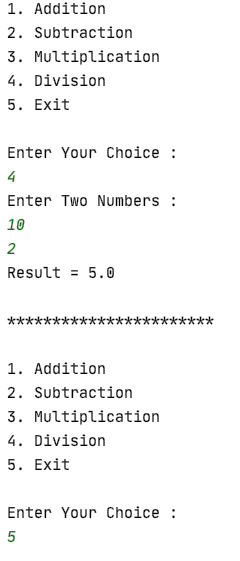

## Simple Java Calculator

A basic calculator in Java programming language which performs four mathematical operations i.e., addition, subtraction, multiplication, and division.
It uses the switch case to identify the input operator to perform required calculation and then display's the result on a computer console.

## Installation: 

Download or clone the repository and start the game by opening index.html page in your desired browser.

```sh
$ git clone https://github.com/AAdewunmi/SimpleCalculator.git
$ cd SimpleCalculator
```
## Console display : 


